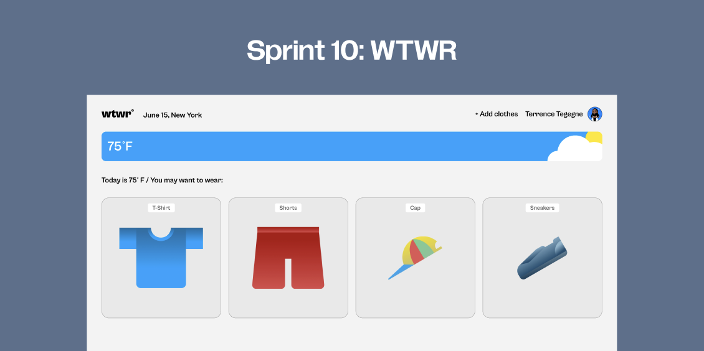
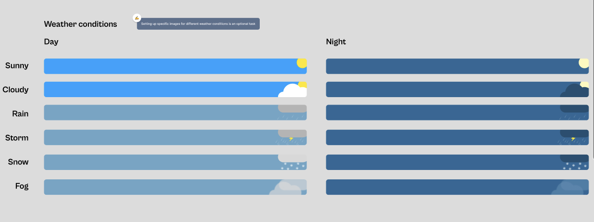
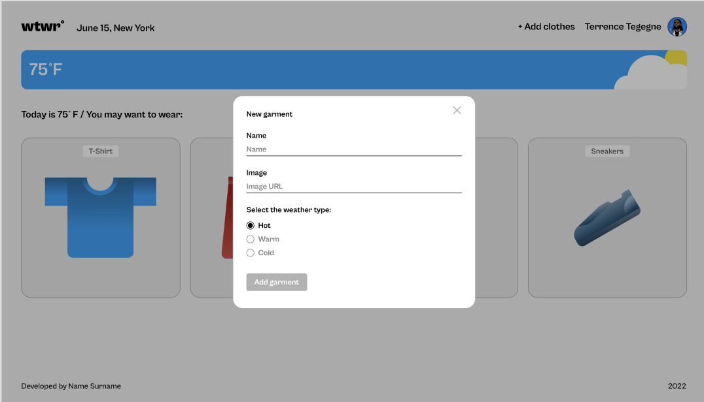
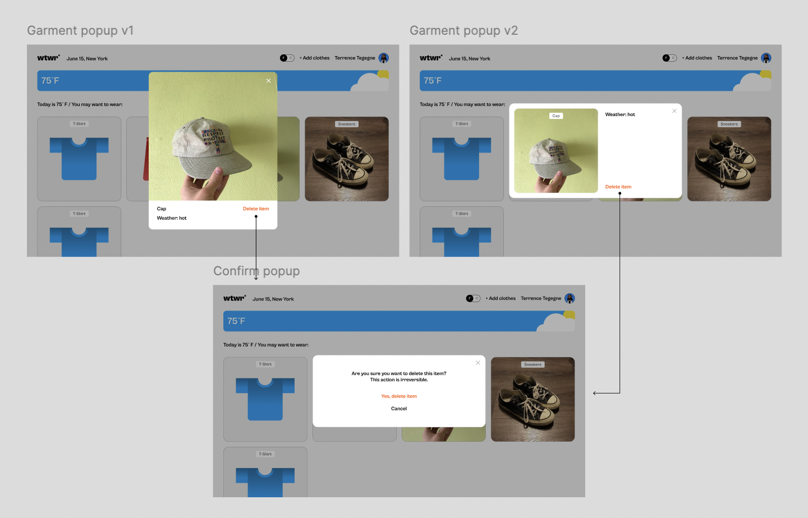
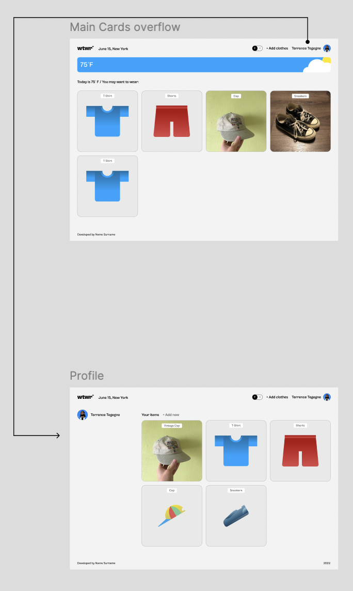

# WTWR (What to Wear?) – Front End

The WTWR (What to Wear?) front-end application is the client-side interface for the WTWR project. It is a React-based single-page application (SPA) that interacts with the WTWR back-end API and an external weather API to provide users with personalized clothing recommendations based on real-time weather conditions.

# Table of Contents

1. Overview
2. Project Features
3. Technologies Used
4. Implementation
5. Screenshots & UI Previews
6. Results
7. Future Improvements
8. Links & Resources

# Overview

This front-end project is part of the TripleTen Software Engineer program and focuses on:

Building a modern React front-end from scratch

Integrating with weather APIs for dynamic, location-based content

Communicating with the WTWR back-end server for user authentication, clothing management, and personalized recommendations

# Domain and Deployment:

# DOMAIN NAME: bnene.com

api.wtwr.bnene.com
wtwr.bnene.com
www.wtwr.bnene.com

# Project Features

- Weather-based clothing recommendations using asynchronous fetch requests

- Responsive UI with clothing cards that filter dynamically

- Temperature unit toggle using React Context

- Profile page and route management using React Router

- Controlled forms and ref-based submissions

- User authentication and protected routes for registration and login

- Token-based authorization integrated with the back end

# Technologies Used

React (with Hooks)

React Router for routing

Context API for state management

Vite for fast front-end build and development

HTML5 & CSS3 for semantic structure and styling

JavaScript (ES6+) for front-end logic

Fetch API for asynchronous requests

Google Cloud, PM2, Nginx, Certbot for deployment and SSL security

# Implementation

Phase I – Initial Front-End
Built the application UI from scratch using HTML, CSS, and vanilla JS

    Converted to React SPA with dynamic weather API integration

    Fetched location-specific weather data and filtered clothing cards accordingly

Phase II – React Enhancements
Added temperature unit toggle with Context API

    Created profile page routing with React Router

    Implemented form submissions using controlled components and refs

Phase III – Authentication & Authorization
Integrated registration, login, and token-based authentication

    Added protected routes for authorized access

    Synced front-end with the Node.js/Express back-end for data persistence

# Deployment Phase – Hosting on Cloud

Deployed the project using Google Cloud Services

Configured PM2 for uptime and crash recovery

Set up Nginx reverse proxy and DNS for custom domains

Secured traffic with SSL via Certbot

# Screenshots & UI Previews

Phase I – Initial UI:

Phase II – Interactivity & Routing:

Phase III – Authentication & UI Updates:
UI updates:

# Figma Design Reference:

WTWR Sprint 14 Design

FIGMA DESIGN: https://www.figma.com/design/bfVOvqlLmoKZ5lpro8WWBe/Sprint-14_-WTWR?node-id=1-170&t=jOf4VV0ePuadhmch-0

# Results

Fully functional React SPA with secure authentication and API integration

Responsive and interactive UI with weather-driven content

Successfully deployed to cloud with custom domain and SSL

# Future Improvements

Add progressive web app (PWA) features for offline use

Implement drag-and-drop wardrobe management

Enhance API error handling and loading states

Optimize images and components for even faster load times

# Links & Resources

Back-End Repository: se_project_express
Front-End Deployment: wtwr.bnene.com
API Endpoint: api.wtwr.bnene.com
Figma Design: WTWR Sprint 14
LINK TO BACKEND:
https://github.com/luckygith/se_project_express.git
